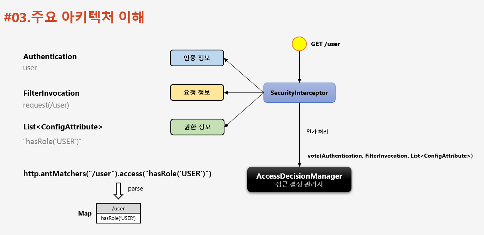
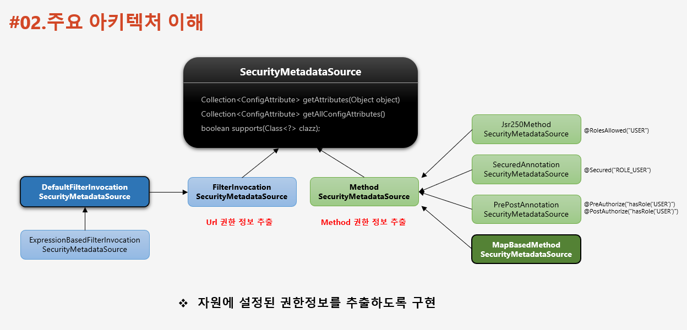
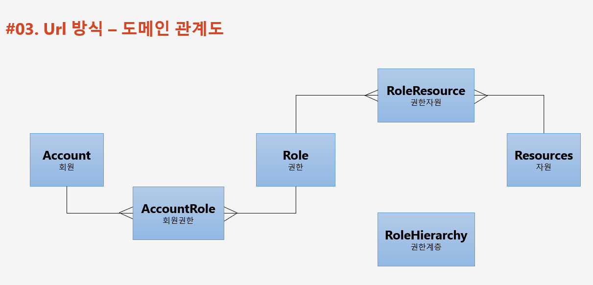
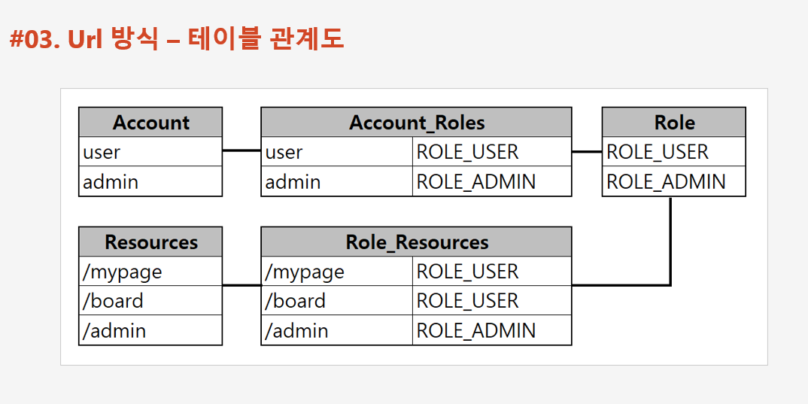
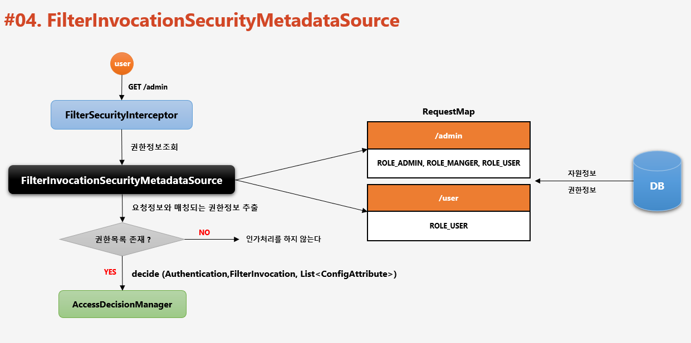
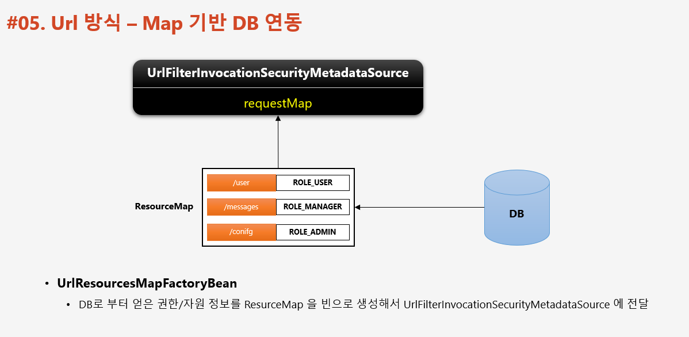
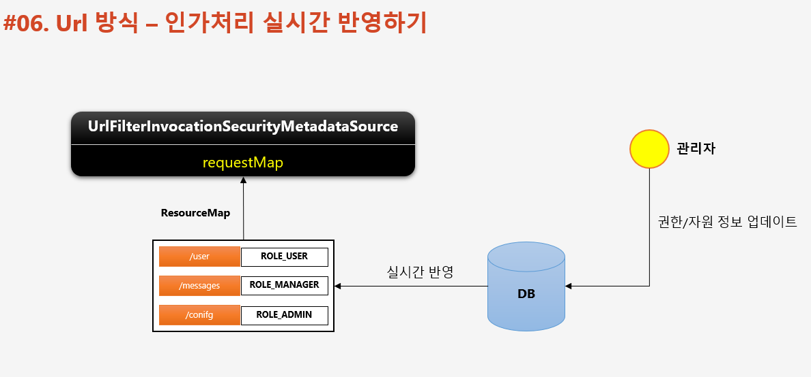
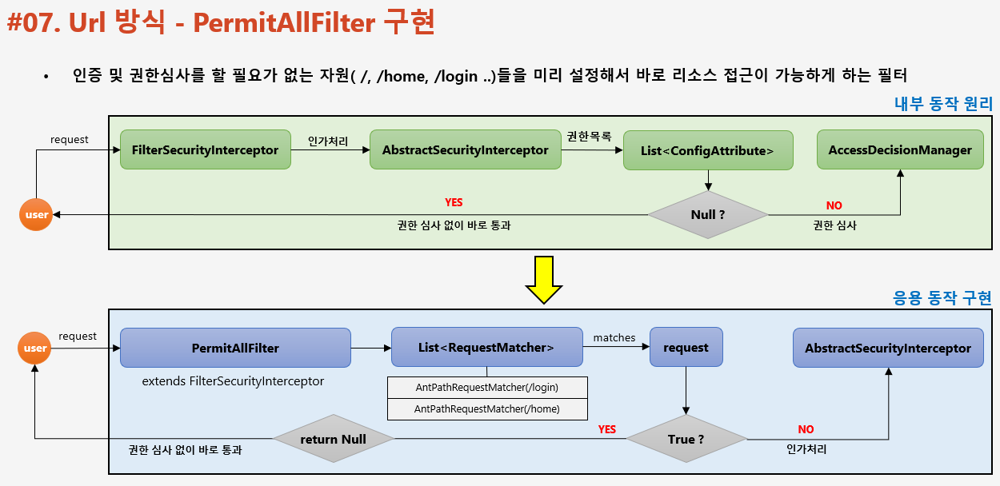
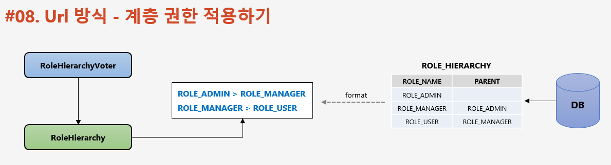
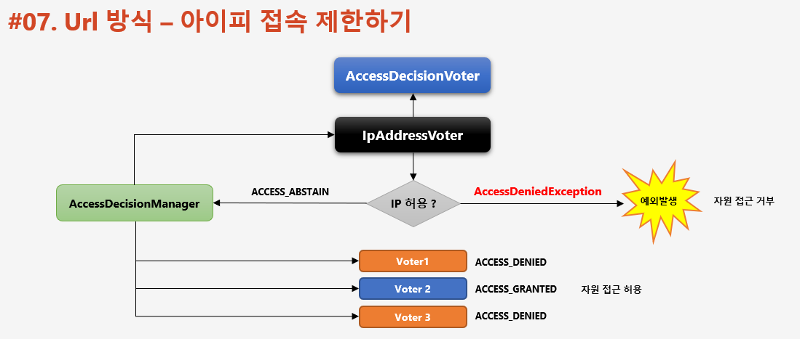

## 인가(Authorization) 프로세스 구현 - DB 연동

## 개요
DB와 연동하여 자원 및 권한을 설정하고 제엏마으로 **동적 권한** 관리가 가능하도록 한다.

- 설정 클래스 소스에서 권한 관련 코드 제거
    - ```antMatcher("/user").hasRole("USER")```
- 관리자 시스템 구축
    - 회원 관리 : 권한 부여
    - 권한 관리 : 권한 생성, 삭제
    - 자원 관리 : 자원 생성, 삭제, 수정, 권한 매핑
- 권한 계층 구현
    - URL - Url 요청 시 인가 처리
    - Method - 메소드 호출 시 인가 처리
        - Method
        - Pointcut

## 주요 아키텍쳐 이해

- 스프링 시큐리티의 인가처리
```
http.antMatchers("/user").access("hasRole('USER')")
```
- 사용자가 /user 자원에 접근하기 위해서 ROLE_USER 권한이 필요하다
    - 인증정보 (사용자)
    - 요청정보 (자원)
    - 권한정보 (권한)

요청이 들어올 경우 SecurityInterceptor는 3가지의 ```인증, 요청, 권한```정보를 담아 접근 결정 관리자에게 인가처리를 요청한다.

- 인증정보의 경우 SC에서 얻을 수 있다.
- 요청정보는 해당 요청 객체를 생성해 요청 정보를 얻을 수 있다.
- 권한정보는 각각의 자원에 대한 권한 정보는 설정 클래스에서 설정한 정보를 Map 객체에 저장하기에 권한정보가 필요할 경우 Map 객체를 통해 얻을 수 있다.
    - Map 객체는 권한정보를 ```List<ConfigAttribute>``` 타입으로 저장해서 반환해준다.
      ```ExpressionBasedFilterInvocationSecurityMetadataSource.class``` 에서 해당 객체에서 필요한 권한정보를 찾아 반환해준다.



권한정보인 SecurityMatadataSource 를 얻기 위해서는 2가지 방식이 존재한다.
```
SecurityMatadataSource {
  Collection<ConfigAttribute> getAttributes(Object object)
  Collection<ConfigAttribute> getAllConfigAttibutes()
  boolean supports(Class<?> clazz)
}
```

1. Url
    1. ```ExpressionBasedFilterInvocationSecurityMetadataSource -> DefaultFilterInvocationSecurityMetadataSource -> FilterInvocationSecurityMetadataSource```
2. Method
    1. ```@RolesAllowed("USER") -> MethodSecurityMetadataSource```
    2. ```@Secured("ROLE_USER") -> MethodSecurityMetadataSource```
    3. ```@PreAuthorize("hasRole('USER')") -> MethodSecurityMetadataSource```
    4. ```@PostAuthorize("hasRole('USER')") -> MethodSecurityMetadataSource```
    5. ```MapBasedMethodSecurityMetadataSource -> MethodSecurityMetadataSource```



## 관리자 시스템 구성

- 도메인


- 테이블


## FilterInvocationSecurityMetadataSource
url 방식을 사용할때 ```FilterInvocationSecurityMetadataSource``` 인터페이스를 구현하면 된다. 해당 인터페이스가 하는 일은 아래와 같다
- 사용자가 접근하고자 하는 Url 자원에 대한 권한 정보 추출을 한다.
- ```AccessDecisionManager``` 접근 관리 결정자 에게 전달하여 인가 처리 수행
- DB 로 부터 자원 및 권한 정보를 매핑하여 맵으로 관리
- 사용자의 매 요청마다 요청정보에 매핑된 권한 정보 확인

### 흐름 과정

1. 사용자 요청
2. ```FilterSecurityInterceptor``` (맨 마지막 보안 필터)가 요청을 받는다
3. ```FilterInvocationSecurityMetadataSource``` 를 호출하여 권한정보를 추출한다.
    1. 권한정보는 RequestMap 해당 객체 아래의 정보를 가지고 이를 통해 권한정보를 추출한다.
        1. 해당 정보는 설정 정보를 통해 가져올 수 있으며, 아래의 정보를 가진 Map객체가 된다. (Config file에 작성한 정보 or DB정보)
            1. key : URL 자원 정보를
            2. value : 자원에 접근하기 필요한 권한정보
4. 권한 목록이 존재할 경우
    1. 접근 관리 결정자에게 전달한다 ```decide (Authentication, FilterInvocation, List<ConfigAttribute>)```
5. 존재하지 않을 경우
    1. 인가처리를 하지 않는다.



## Url 방식 - Map 기반 DB 연동



UrlResourcesMapFactoryBean
- DB로 부터 얻은 권한/자원 정보를 ```RequsetMap``` 을 빈으로 생성하여 ```UrlFilterInvocationSecurityMetadataSource``` 에 전달

## 인가처리 실시간 반영하기

- UrlFilterInvocationSecurityMetadataSource 에 저장된 권한 / 자원정보를 관리자가 수정해서 DB에 반영이 될 경우 실시간으로 반영하여 인가처리할 수 있는 데이터가 반영되도록 하는 작업이다.



## PermitAllFilter 구현

- 인증 및 권한심사를 할 필요가 없는 자원 ```/, /login, /home``` 들을 미리 설정해서 바로 리소스 접근이 가능하도록 하는 필터

- 내부 동작 원리
    1. ```FilterSecurityInterceptor``` 가 요청을 받고 ```AbstractSecurityInterceptor``` 에게 인가처리를 요청한다.
    2. 인가처리 시 ```List<ConfigAttribute>``` 값이 존재한다면 ```AccessDecisionManager``` 에서 권한심사를 받고 아니면 통과한다.
- 응용 동작 구현
    1. ```PermitAllFilter``` 가 요청을 받고 ```List<RequestMatcher>``` 에서 예외 자원이 있는지 확인 후 있을 경우 통과하며 없을 경우 ```AbstractSecurityInterceptor``` 에서 인가처리를 받는다.
        - 인가처리를 하지 않을 자원들은 ```FilterSecurityInterceptor``` 처리 보다 ```PermitAllFilter``` 로 구현 후 처리해 주는 것이 더욱 간단하다.



## 계층 권한 적용하기

SpringSecurity 는 Admin - User 권한은 서로 다른 권한으로 취급한다.
하지만 우리는 admin 권한을 가지고 있으면 상하 관계로 manager, user 권한을 접근할 수 있게 한다.

- RoleHierarchy
    - 상위 계층 Role은 하위 계층 Role의 자원에 접근 가느함
    - ```ROLE_ADMIN > ROLE_MANAGER > ROLE_USER``` 일 경우 상위 권한은 하위 권한을 모두 포함한다.
- RoleHierarchyVoter
    - ```RoleHieerarchy``` 를 생성자로 받으며 이 클래스에서 설정한 규칙이 적용되며 심사함.



## 아이피 접속 제한하기

- IpAddressVoter
  - 특정한 IP 만 접근이 가능하도록 심의하는 Voter 추가
  - Voter 중에서 가장 먼저 심사하도록 하여 허용된 IP 일 경우에만 최종 승인 및 거부 결정을 하도록 한다.
  - 허용된 IP 이면 ACCESS_GRANTED 가 아닌 ACCESS_ABSTAIN 을 리턴해서 추가 심의를 계속 진행하도록 한다
    - 원래 승인이 되면 ACCESS_GRANTED 를 리턴한다. 
  - 허용된 IP 가 아니면 ACCESS_DENIED 를 리턴하지 않고 즉시 예외 발생하여 최종 자원 접근 거부


