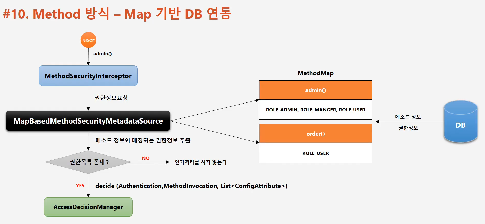
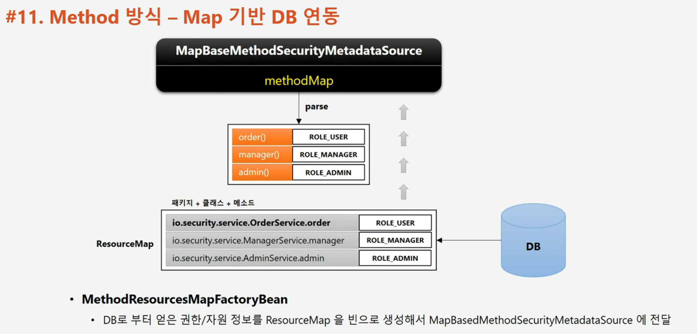
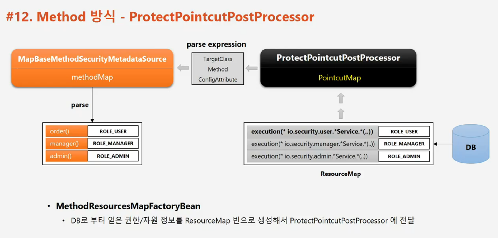

# 인가 프로세스 DB 연동 서비스 계층 구현 

기존 section5 에서 진행한 인가 프로세스 DB 연동 웹 계층 구현은 url 과 같은 자원을 화면, 메뉴 단위로 인가처리를 진행했다.

---
## 개요

1. 서비스 계층의 인가처리 방식
   - 화면, 메뉴 단위가 아닌 기능 단위로 인가처리
   - 메소드 처리 전, 후로 보안 검사 수행하여 인가처리
2. AOP 기반으로 동작
   - 프록시와 어드바이스로 메소드 인가처리 수행
3. 보안 설정 방식
   - 어노테이션 권한 설정 방식
     - 표현식을 이용
       - ```@PreAuthorize("hasRole('USER')")```
       - ```@PostAuthorize("hasROle('USER')")```
       - ```@Secured("ROLE_USER")```
   - 맵 기반 권한 설정 방식
       - 맵 기반 방식으로 외부와 연동하여 메소드 보안 설정 구현 
        
## method 방식 - 주요 아키텍처

인가 처리를 위한 초기화 과정과 진행

1. 초기화 과정
   1. 초기화 시 전체 빈을 검사하면서 보안이 설정된 메소드가 있는지 탐 색 (빈 후 처리기)
   2. 빈의 프록시 객체를 생성
   3. 보안 메소드에 인가처리(권한심사) 기능을 하는 Advice 를 등록
   4. 빈 참조시 실제 빈이 아닌 프록시 빈 객체를 참조


2. 진행과정
   1. 메소드 호출 시 프록시 객체를 통해 메소드를 호출
   2. Advice 가 등록되어 있다면 Advice 를 작동하게 하여 인가 처리
   3. 권한 심사가 통과하면 실제 빈의 메소드를 호출한다.


## Method 방식 - 어노테이션 권한 처리
- 보안이 필요한 메소드에 설정한다.
- ```@PreAuthorize```, ```@PostAuthorize```
    - SpEL 지원
    - ```@PreAuthorize("hasRole('ROLE_USER') and (#account.user.name == principal.username)")```
    - ```PrePostAnnotationSecurityMetadataSource``` 가 담당
- ```@Secured```, ```@RolesAllowed```
    - SpEL 미지원
    - ```@Secured ("ROLE_USER")```, ```@RolesAllowed("ROLE_USER")```
    - ```SecuredAnnotationSecurityMetadataSource```, ```Jsr250MethodSecurityMetadataSource``` 가 담당
- ```@EnableGlobalMethodSecurity(prePostEnabled = true, securedEnabled = true)```    
    - 각각의 어노테이션에 맞는 설정을 true 로 변경 해주어야 한다. (default = false)

## Mehod 방식 - Map 기반 DB 연동

### Filter 기반 URL 방식
1. URL 요청 시
2. ```FilterSecurityInterceptor``` -> ```FilterInvocationSecurityMetadataSource``` <- ```MethodMap``` <- DB
3. ROLE_USER (권한 목록) -> ```AccessDeniedManager```
### AOP 기반 Method 방식
1. Order() Method 요청 시
2. ```MethpdSecurityInterceptor``` -> ```MethodSecurityMetadataSource``` -> ```MethodMap``` <- DB
3. ROLE_USER (권한 목록) -> ```AccessDeniedManager```

*```@EnableGlobalMethodSecurity(prePostEnabled = true, securedEnabled = true)```* 중요

### MapBasedMethodSecurityMetadataSource
1. 어노테이션 설정 방식이 아닌 맵 기반으로 권한 설정
2. 이미 기본적인 구현이 되어 있어 DB로부터 자원과 권한정보를 매핑한 데이터를 전달하면 메소드 방식의 인가처리가 이루어지는 클래스


### 동작과정
1. admin() 접근 시 등록된 어드바이스를 통해 ```MethodSecurityInterceptor``` 로 이동
2. ```MethodSecurityInterceptor``` 에서 ```MapBasedMethodSecurityMetadataSource``` 에게 권한정보를 요청
3. ```MapBasedMethodSecurityMetadataSource``` 는 DB에서 Map 형식의 권한정보를 조회
4. 권한목록의 존재여부에 따라 인가 ```decide(Authentication, MethodInvocation, List<ConfigAttribute>)``` -> ```AccessDecisionManager```



### MapBaseMethodSecurityMetadataSource Map 기반 DB 연동
이미 기본적으로 구현이 되어있는 ```MapBaseMethodSecurityMetadataSource``` 에게 DB 에서 조회한 권한을 ResourceMap 형태로 넘겨주면 된다.

- ```MethodResourcesMapFactoryBean``` 
    - DB로 부터 얻은 권한/자원 정보인 ResourceMap 을 빈으로 생성해서 넘겨주면 된다.
    


## Method 방식 - ProtectPointcutPostProcessor
- 메소드 방식의 인가처리를 위한 자원 및 권한정보 설정 시 자원에 포인트 컷 표현식을 사용할 수 있도록 지원하는 클래스
- 빈 후처리기로서 스프링 초기화 과정에서 빈 들을 검사하여 빈이 가진 메소드 중에서 포인트 컷 표현식과 matching 되는 클래스, 메소드, 권한 정보를 ```MapBasedMethodSecurityMetadataSource``` 에 전달하여 인가처리가 되도록 제공하는 클래스
- DB 저장 방식
    - Method 방식 
        - ```io.security.service.OrderService.order : ROLE_USER```
    - Pointcut 방식
        - ```execution(*io.security.service.*Service.*(..)) : ROLE_USER```
- 설정 클래스에서 빈 생성 시 접근제한자가 package 범위로 되어 있기 때문에 리플렉션을 이용해 빈을 생성한다.
- MethodResourcesMapFactoryBean
    - DB로 부터 얻은 권한/자원 정보를 ResourceMap 빈으로 생성해서 ProtectPointcutPostProcessor 에 전달

