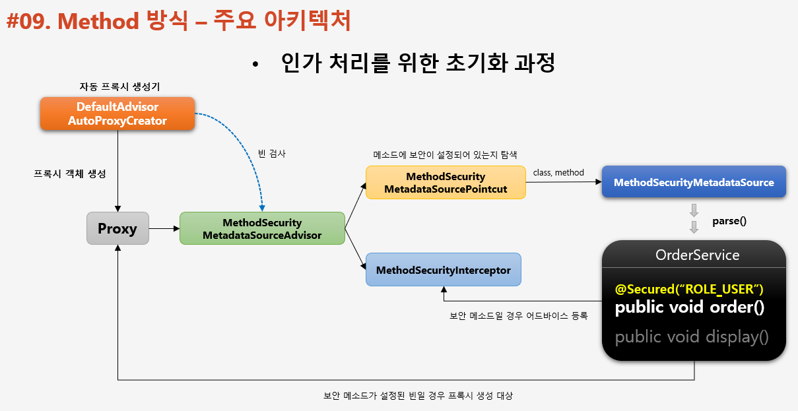
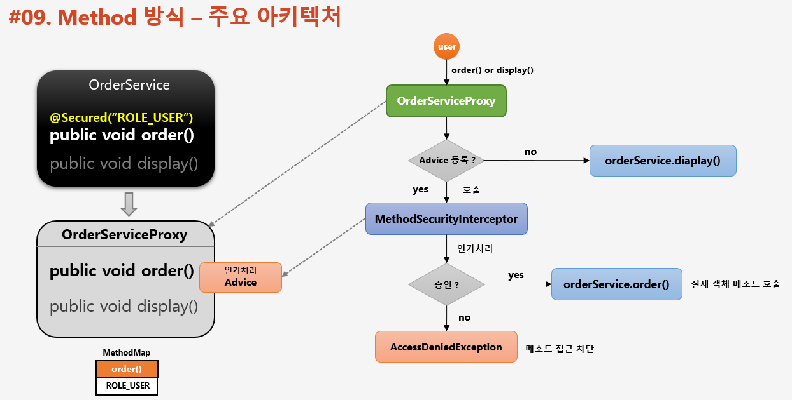

# 인가 프로세스 DB 연동 서비스 계층 구현 

기존 section5 에서 진행한 인가 프로세스 DB 연동 웹 계층 구현은 url 과 같은 자원을 화면, 메뉴 단위로 인가처리를 진행했다.

---
## 개요

1. 서비스 계층의 인가처리 방식
   - 화면, 메뉴 단위가 아닌 기능 단위로 인가처리
   - 메소드 처리 전, 후로 보안 검사 수행하여 인가처리
2. AOP 기반으로 동작
   - 프록시와 어드바이스로 메소드 인가처리 수행
3. 보안 설정 방식
   - 어노테이션 권한 설정 방식
     - 표현식을 이용
       - ```@PreAuthorize("hasRole('USER')")```
       - ```@PostAuthorize("hasROle('USER')")```
       - ```@Secured("ROLE_USER")```
   - 맵 기반 권한 설정 방식
       - 맵 기반 방식으로 외부와 연동하여 메소드 보안 설정 구현 
        
## method 방식 - 주요 아키텍처

인가 처리를 위한 초기화 과정과 진행

1. 초기화 과정
   1. 초기화 시 전체 빈을 검사하면서 보안이 설정된 메소드가 있는지 탐 색 (빈 후 처리기)
   2. 빈의 프록시 객체를 생성
   3. 보안 메소드에 인가처리(권한심사) 기능을 하는 Advice 를 등록
   4. 빈 참조시 실제 빈이 아닌 프록시 빈 객체를 참조



2. 진행과정
   1. 메소드 호출 시 프록시 객체를 통해 메소드를 호출
   2. Advice 가 등록되어 있다면 Advice 를 작동하게 하여 인가 처리
   3. 권한 심사가 통과하면 실제 빈의 메소드를 호출한다.



## Method 방식 - 어노테이션 권한 처리
- 보안이 필요한 메소드에 설정한다.
- ```@PreAuthorize```, ```@PostAuthorize```
    - SpEL 지원
    - ```@PreAuthorize("hasRole('ROLE_USER') and (#account.user.name == principal.username)")```
    - ```PrePostAnnotationSecurityMetadataSource``` 가 담당
- ```@Secured```, ```@RolesAllowed```
    - SpEL 미지원
    - ```@Secured ("ROLE_USER")```, ```@RolesAllowed("ROLE_USER")```
    - ```SecuredAnnotationSecurityMetadataSource```, ```Jsr250MethodSecurityMetadataSource``` 가 담당
- ```@EnableGlobalMethodSecurity(prePostEnabled = true, securedEnabled = true)```    
    - 각각의 어노테이션에 맞는 설정을 true 로 변경 해주어야 한다. (default = false)
